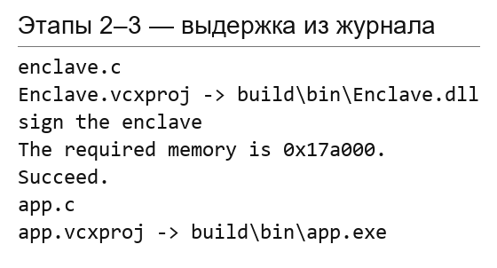
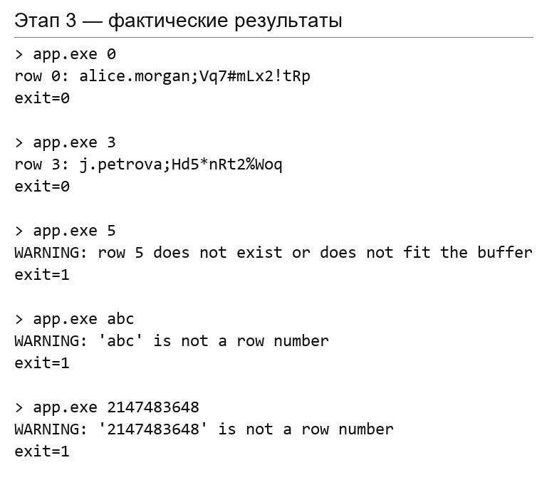
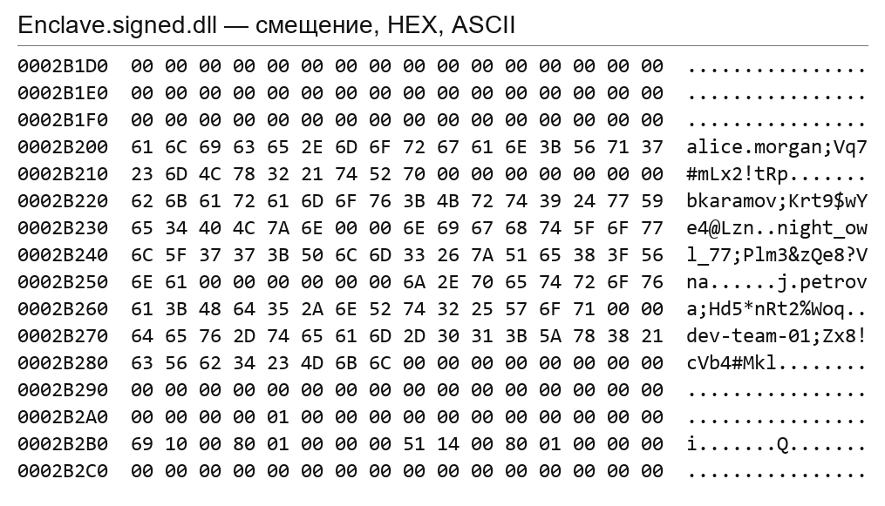

# ЛР3 — доверенная среда выполнения Intel SGX

Мухортов Борис Юрьевич, группа 221-331.

Таблица из пяти вымышленных учётных записей вынесена в анклав. Клиент получает
строку по номеру через ECALL. Работа собрана и проверена **07.10.2026** в
**Simulation / x64** на Windows с Visual Studio Community 2019.

## Результат по этапам

| Этап методички | Реализация | Проверка |
|---|---|---|
| 1. Незащищённое приложение | `stage1/table_app.c` | собрано; 15 из 15 проверок |
| 2. Таблица и функция внутри анклава | `enclave/enclave.c`, `Enclave.edl`, `Enclave.config.xml` | DLL собрана; подпись sgx_sign: Succeed |
| 3. Интеграция клиента | `app/app.c`, генерируемые мосты ECALL | создание анклава, запросы и завершение; 15 из 15 проверок |
| Анализ бинарных файлов | поиск строк и hex-дамп с файловыми смещениями | в app.exe строки отсутствуют; в DLL анклава присутствуют |

**Ограничение пункта о hex-анализе:** отсутствие открытой таблицы в DLL
не подтверждено. Статические строки остаются в подписанном файле анклава.
Ни цифровая подпись, ни Simulation не означают, что DLL зашифрована.
Подробное объяснение приведено ниже.

## Структура

- `LR3.sln` — решение клиента и анклава, Simulation / x64.
- `stage1/table_app.c`, `stage1/table_app.vcxproj` — исходная версия без SGX.
- `enclave/` — таблица, функция ECALL, EDL, конфигурация и проект анклава.
- `app/` — клиент и его проект.
- `build.ps1` — сборка всех этапов и подготовка библиотек среды выполнения.
- `verify.ps1` — 30 проверок запуска, поиск строк и создание hex-дампа.
- `analysis/logs/` — текстовые и JSON-результаты проверок.
- `analysis/figures/` — иллюстрации, сформированные из актуальных журналов.
- `theory_answers.md` — пояснения к защите.

Сгенерированные мосты, результаты сборки, локальные ключи и настройки IDE
исключены из Git. Закрытый ключ подписи не требуется брать из чужого проекта:
он создаётся автоматически при первой сборке.

## Среда и сборка

Нужны Windows x64, Visual Studio **2019** с компонентами C++ (v142), Windows SDK
и Intel SGX SDK for Windows. Плагины SEConfigureVS2019.vsix и SEWizardVS2019.vsix
используются для работы с мастером проектов из методички. Для повторной сборки
уже подготовленных файлов мастер не требуется.

В этой работе используются инструменты и библиотеки **из извлечённого NuGet-пакета
Intel SGX SDK**. Команды генерации мостов, ключа и подписи явно записаны в
`.vcxproj`. Это повторяет операции SDK, но не требует заново импортировать
анклав через контекстное меню Visual Studio.

Из каталога LR3 в PowerShell:

```powershell
.\build.ps1 -SdkPath 'C:\путь\к\SDK\nuget_extracted\build\native'
```

Параметр — каталог, содержащий `include` и `bin`. Если задана переменная
`SGXSDKInstallPath`, используется она. Без параметра и переменной сценарий
проверяет `Downloads\Intel_SGX_SDK_for_Windows\nuget_extracted\build\native`
текущего пользователя — этот путь проверен на компьютере автора.

Результаты находятся в `build/bin/`:

- `table_app.exe` — этап 1;
- `app.exe` — клиент SGX;
- `Enclave.dll` и `Enclave.signed.dll`;
- шесть библиотек среды Simulation: `sgx_urts_simd.dll`,
  `sgx_uae_service_sim.dll`, `sgx_epid_sim.dll`, `sgx_launch_sim.dll`,
  `sgx_platform_sim.dll`, `sgx_quote_ex_sim.dll`.

Клиент находит подписанный анклав рядом с собственным EXE, а не относительно
текущего каталога терминала. Debug-библиотеки Microsoft C++ предоставляются
установленной средой Visual Studio; комплект не заявляется как автономная
сборка для компьютера без инструментов разработки.

[Журнал сборки и подписи](analysis/logs/stage23_build.txt).



*Иллюстрация построена по журналу инструментов; это не снимок окна IDE.*

## Запуск

```powershell
.\build\bin\table_app.exe 0
.\build\bin\app.exe 0
.\build\bin\app.exe 3
.\build\bin\app.exe 5
.\build\bin\app.exe abc
```

Нумерация: **0–4**. Например:

```text
> app.exe 3
row 3: j.petrova;Hd5*nRt2%Woq
exit=0

> app.exe 5
WARNING: row 5 does not exist or does not fit the buffer
exit=1
```

Все записи вымышленные и используются только как учебные данные.



*Фактический вывод из журнала проверок, оформленный как иллюстрация.*

## Повторная проверка

```powershell
.\verify.ps1
```

Проверяются оба приложения: номера 0–4, -1, 5 и 9; текст `abc` и `1x`;
переполнение числа; отсутствие аргумента и лишний аргумент.
Проверка сравнивает код завершения и вывод с эталоном.
Функциональные тесты: **30/30 PASS**.

- [Полный журнал запусков](analysis/logs/runtime_tests.txt)
- [Результаты в JSON](analysis/logs/runtime_tests.json)
- [Поиск строк и SHA-256 бинарных файлов](analysis/logs/binary_strings.txt)
- [Hex-дамп подписанного анклава](analysis/logs/enclave_hex.txt)

Проверки выполнены также из каталога, отличного от каталога EXE.
При любой неожиданной ошибке сценарий завершается исключением.

## Hex-анализ и модель безопасности

Поиск выполнен для каждой полной строки, а также для логина и пароля отдельно.

| Файл | Результат |
|---|---|
| table_app.exe | найдены все 5 полных строк |
| app.exe | ни полные строки, ни отдельные логины и пароли не найдены |
| Enclave.signed.dll | найдены все 5 полных строк |



*Дамп прочитан из собранной DLL. Левая колонка — смещение от начала файла,
затем байты HEX и ASCII. Иллюстрация не выдаётся за снимок стороннего hex-редактора.*

Строки отсутствуют в клиенте, потому что таблица перенесена в доверенный модуль.
В DLL они остались, потому что таблица объявлена статически. `sgx_sign`
подписывает анклав, но **не шифрует его содержимое**. Поэтому буквальное
требование методички «в DLL не содержится данных в открытом виде» для данного
способа хранения не выполняется; результаты анализа показывают это явно.

В **Simulation** SGX-инструкции имитируются библиотеками: аппаратная изоляция
памяти не проверяется. В аппаратном SGX защита памяти анклава и защита файла
анклава на диске — разные задачи. Кроме того, значение после ECALL попадает
в обычную память клиента и выводится в консоль. Аутентификации клиента здесь нет.

Для реальных секретов нужны отдельная политика доступа и защищённое получение
данных/ключей, например после аттестации; для сохранения состояния применяется
sealing. Дополнительные задания методички по sealing здесь не реализованы.

## Источники и подготовка к защите

- [Методичка, раздел ЛР3](https://docs.google.com/document/d/15X-l26tCHG5XRF5FHY6EVZ9BOy8fh4KWybheBXB_BqY/edit)
- [Intel: Getting Started with SGX SDK for Windows](https://www.intel.com/content/www/us/en/developer/articles/guide/getting-started-with-sgx-sdk-for-windows.html)
- [Intel: жизненный цикл анклава и свойства его файла](https://www.intel.com/content/www/us/en/developer/articles/technical/overview-of-an-intel-software-guard-extensions-enclave-life-cycle.html)
- [Ответы для подготовки к защите](theory_answers.md)

При демонстрации: собрать проект, выполнить корректный и ошибочный запрос,
показать EDL и функцию ECALL, затем сопоставить клиент и подписанную DLL
по журналу поиска и hex-дампу. Вывод о конфиденциальности DLL делать нельзя.
