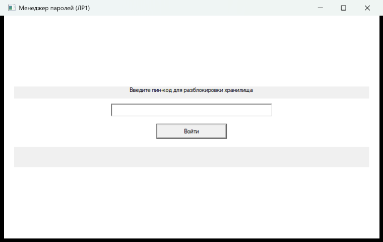
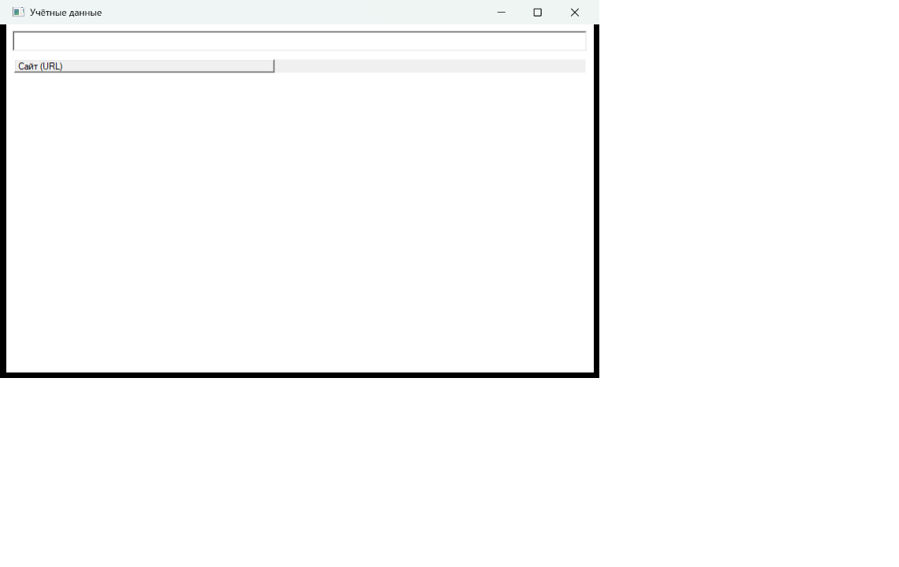
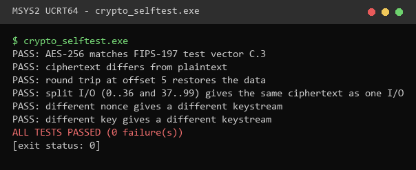
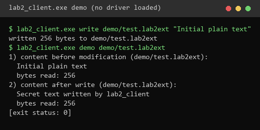
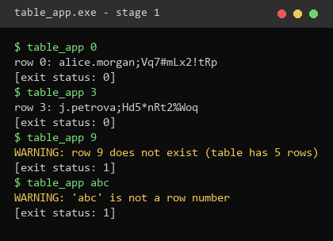
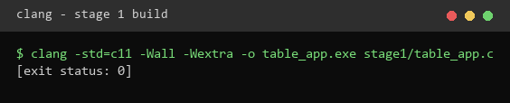
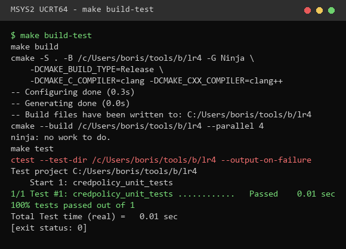
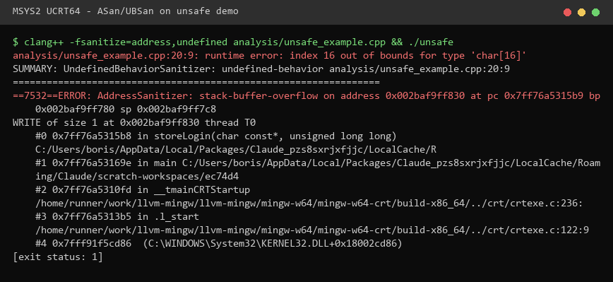

# Лабораторные работы: разработка и эксплуатация автоматизированных систем в защищённом исполнении

Репозиторий содержит четыре лабораторные работы курса (группа 221-331, 2026):
ЛР1 - защита приложения Windows, ЛР2 - минифильтр шифрования, ЛР3 - Intel SGX,
ЛР4 - безопасная разработка (тесты, анализ, фаззинг, CI). Каждая работа находится в своём каталоге
и в своей ветке (`lab1`-`lab4`); завершённые ветки слиты в `main`.

## Статус

| Работа | Что сделано и проверено | Что не выполнено в этой работе |
|---|---|---|
| ЛР1 (`LR1/`) | Приложение с двумя слоями шифрования (AES-256 файла и AES-256-GCM полей), ввод пин-кода, поиск, копирование в буфер; протектор самоотладки; проверка SHA-256 сегмента `.text`; опция IsDebuggerPresent. Сценарии проверены реальным запуском GUI. | Попытка стороннего подключения отладчика выполнена функцией `DebugActiveProcess` из отдельного процесса, а не в x64dbg (x64dbg не установлен). Интерфейс на WinAPI, а не на Qt (методичка допускает C++). |
| ЛР2 (`LR2/`) | Криптоядро (AES-256) и его тесты (6/6 PASS), клиентское приложение, код минифильтра, INF и скрипты загрузки. | Драйвер не собран и не загружен: нужны Visual Studio + WDK и тестовая виртуальная машина с отладкой. |
| ЛР3 (`LR3/`) | Этап 1 (незащищённое приложение) собран и проверен. Код анклава, EDL и клиента написан по образцу Intel. | Этапы 2-3 не собраны: нужны Intel SGX SDK (с аккаунтом Intel) и Visual Studio 2019. |
| ЛР4 (`LR4/`) | Модуль, 8 модульных тестов (GoogleTest), цели Makefile `build`, `test`, `build-test`, `run`, cppcheck, ASan/UBSan, harness AFL++, конвейер GitLab CI из пяти этапов. | Фаззинг AFL++ требует Linux (WSL). Конвейер GitLab CI не запускался: нужен push в GitLab. |

## ЛР1: защита приложения Windows

`PassManager.exe` хранит учётные записи в файле `credentials.bin`. Файл зашифрован AES-256-CBC;
ключ выводится из пин-кода функцией PBKDF2-HMAC-SHA256. Расшифровка выполняется блоками в памяти,
на диск ничего не пишется. Логины и пароли хранятся вторым слоем (AES-256-GCM) и расшифровываются
только по запросу после повторного ввода пин-кода. Значение копируется в буфер обмена.

Защиты: `Protector.exe` запускает менеджер в приостановленном состоянии и подключается к нему
функцией `DebugActiveProcess`, поэтому сторонний отладчик подключиться не может. Постобработка
`tools/patch_text_hash.py` записывает SHA-256 сегмента `.text`; при изменении кода приложение блокирует
ввод пин-кода. Опция `LR1_CHECK_IS_DEBUGGER_PRESENT` включает проверку `IsDebuggerPresent()`.

Сборка (каталог зависимостей - MSYS2 `ucrt64`, OpenSSL и nlohmann/json; путь к проекту лучше короткий):

```
cmake -S LR1 -B C:/b/lr1 -G Ninja -DCMAKE_CXX_COMPILER=clang++ -DLR1_DEPS_ROOT=C:/msys64/ucrt64
cmake --build C:/b/lr1
C:/b/lr1/bin/CredentialTool.exe check 7391 LR1/data/credentials.bin
```

Тестовый пин-код `7391` указан только для демонстрации; в коде и в файлах он не хранится.




## ЛР2: прозрачное шифрование минифильтром

Драйвер `passthrough` (FltMgr, высота 141000) шифрует данные файлов `*.lab2ext` в операции записи
и расшифровывает их в постоперационной обработке чтения. Ядро шифрования (`src/crypto_core.c`)
общее для драйвера и тестов. Оно проверено: вектор FIPS-197 совпадает, обработка по частям даёт тот же
результат, что и целиком.

```
cmake -S LR2 -B C:/b/lr2 -G Ninja -DCMAKE_C_COMPILER=clang
cmake --build C:/b/lr2
C:/b/lr2/bin/crypto_selftest.exe
```

Драйвер собирается в Visual Studio с WDK и проверяется в тестовой виртуальной машине (см. `LR2/README.md`).




## ЛР3: доверенная среда выполнения (Intel SGX)

Этап 1 - консольное приложение `stage1/table_app.c`: номер строки передаётся аргументом, при отсутствии
строки выводится предупреждение. Этапы 2-3 (анклав, EDL, клиент) написаны, но не собраны (см. `LR3/README.md`).

```
clang -std=c11 -Wall -Wextra -o table_app.exe LR3/stage1/table_app.c
table_app.exe 3
```




## ЛР4: безопасная разработка

Модуль `credpolicy` (проверка политики паролей и разбор строк записей) покрыт 8 модульными тестами
GoogleTest: по два позитивных и два негативных случая на каждую функцию. Статический анализ cppcheck и
динамический анализ AddressSanitizer/UBSan проверены на модуле и на демонстрационном файле с намеренно
внесённой ошибкой выхода за границу буфера.

```
cd LR4
make build-test BUILD_DIR=C:/b/lr4     # сборка и тестирование
make test BUILD_DIR=C:/b/lr4           # только тестирование
make run BUILD_DIR=C:/b/lr4            # запуск на samples/records.txt
make static                            # cppcheck
make asan BUILD_SAN_DIR=C:/b/an        # ASan + UBSan
```




Конвейер `.gitlab-ci.yml` (этапы build, unit-tests, static-analysis, dynamic-analysis, fuzz)
выполняет те же цели `Makefile` в контейнере Ubuntu 24.04.

## Замечания

- Путь к проекту и каталог сборки на Windows не должны быть длинными (ограничение 260 символов).
- Снимки экрана ЛР1 сделаны с окна приложения; снимки ЛР2 и ЛР3 - текст реального вывода консоли,
  оформленный как изображение; их можно заменить снимками экрана со своей машины.
- Репозиторий назван по шаблону методички `221-331_Lastname`; фамилию нужно заменить.
